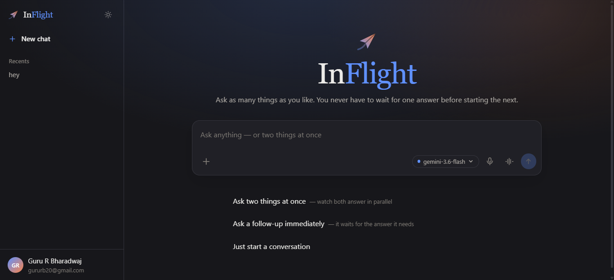
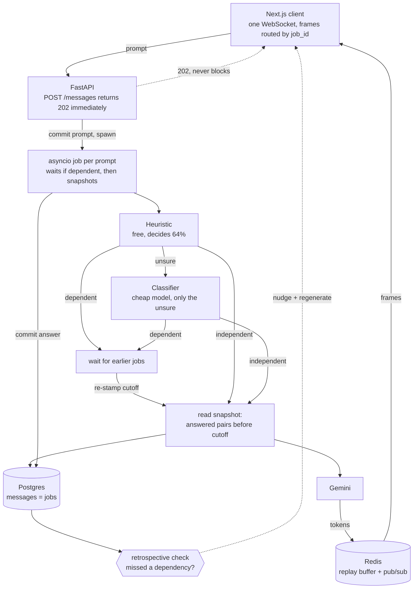

# InFlight

**A chat where the input box is never locked.** Fire a follow-up while a previous
answer is still generating; both run concurrently against one shared, evolving
history, and each is reconciled back into it using a snapshot-based (MVCC-like)
concurrency model rather than a hard queue.



The name is the state the interface is built around: at any moment several answers
are *in flight*, and the design's job is to make that legible rather than hide it
behind a spinner. It is a systems/concurrency project wearing an AI costume — the
interesting part is not the model call, but deciding what "the conversation so far"
means when two answers are being written at once.

---

## The core idea

Concurrency control lives in the `messages` table, which stores *jobs*, not just
chat bubbles. Three timestamps do the work:

| Column | Meaning |
| --- | --- |
| `submitted_at` | When the user hit send — controls **display** order. |
| `completed_at` | When generation finished — controls **commit** order; a row becomes visible as context only once committed. |
| `context_cutoff` | The read snapshot stamped on the job at start; it may read only messages committed strictly before this instant. |

With one prompt in flight these three collapse into the same ordering, which is
why ordinary chat apps never distinguish them. With two in flight they come apart —
and that gap is the whole problem. Prompt B, submitted while A is still generating,
must be answered against *some* version of history, and the version that exists
when B is submitted is not the version that exists when B finishes.

That is a read-isolation problem, so InFlight borrows the database answer: a job's
`context_cutoff` is a **read snapshot**, dependency detection is **conflict
prediction**, and the regenerate nudge is **abort-and-retry**. `GET
/conversations/{id}/context` makes the read side inspectable — it returns exactly
what a job stamped at a given instant is allowed to see.

### Architecture



The load-bearing detail is the dotted line: the `202` returns before any of the
rest happens. Everything expensive — classification, waiting, generation — lives
in the job, never in the request.

---

## Results

Three claims, three harnesses:

```bash
docker compose exec backend python -m scripts.concurrency_sim   # is it correct?
docker compose exec backend python -m scripts.eval_pipeline     # does it know when to wait?
docker compose exec backend python -m scripts.load_test --jobs 24  # does it hold under load?
```

**Is the concurrency correct?** A randomised interleaving checker simulates
thousands of schedules of concurrent prompts against a virtual microsecond clock,
and asserts the invariants the design rests on — snapshot isolation (no job reads
a message committed at or after its own cutoff), no torn reads, deadlock-free
waiting, and a total, permutation-invariant display order (checked against the
real `order_for_display`). It self-tests by reintroducing two real bug classes,
including the `timestamptz(3)` collision this project actually hit, and failing if
the checker can no longer catch them. 5000 runs, ~38k isolation-checked reads,
zero violations.

**Does it know when a prompt must wait?** 50 hand-labelled prompts
([eval/dependency_cases.json](eval/dependency_cases.json)), balanced 25/25, run
through the real path — heuristic first, classifier only for what it defers.

| | decided | accuracy |
| --- | --- | --- |
| Heuristic alone | 32/50 (64%) | 32/32 (100%) |
| + classifier | 50/50 (100%) | **50/50 (100%)** |

Missed dependencies: 0. Needless waits: 0. That asymmetry is the point — a missed
dependency ships a wrong answer; a needless wait costs only latency. These are 50
self-authored cases, so the honest reading is "no *known* failure mode is
unhandled", not a true error rate.

**Does concurrency hold under load?** N prompts at randomised intervals against
the local generator.

| prompts | peak concurrent | submit median | TTFT median | wall |
| --- | --- | --- | --- | --- |
| 4 | 4 | 34 ms | 59 ms | 4.1 s |
| 16 | 16 | 30 ms | 53 ms | 4.9 s |
| 24 | 24 | 38 ms | 70 ms | 6.4 s |

Peak concurrency equals the number submitted at every level — nothing is quietly
serialised — and submit latency stays flat at 30–50 ms whether 4 or 24 answers are
already streaming. That is the non-blocking claim as a measurement, not an
assertion.

---

## Features

- **Non-blocking concurrency** — many prompts generate at once against one shared
  history, each reading its own snapshot.
- **Dependency handling** — prompts needing an earlier answer are detected and made
  to wait; a manual `↩ chain` forces the wait with no prediction; a retrospective
  nudge catches misses with one-click regenerate.
- **Accounts** — signup/login (bcrypt + JWT), per-user conversation isolation.
- **Model picker** — any Gemini chat model the API key can use, queried live.
- **Attachments** — images, camera capture, and public GitHub file contents.
- **Voice** — hold-to-talk and live dictation via the Web Speech API.
- **Live status strip** — answers in flight, answers landed, tokens, and estimated
  cost, all updating off the same frames that fill the bubbles.
- **Observability** — Prometheus metrics at `/metrics` (job outcomes, dependency
  verdicts, wait/TTFT/generation latency histograms, live concurrency) and a
  per-job trace ring buffer at `/traces` for walking one generation's lifecycle.
- **Resilient streaming** — a formalized at-least-once protocol with per-job
  sequence numbers, client-side dedup, and gap-healing resync, so a dropped or
  duplicated frame never renders as a hole. See
  [docs/streaming-protocol.md](docs/streaming-protocol.md).
- **Fair scheduler** — a process-wide admission layer with a global concurrency
  bound, a token-bucket rate limit (overload becomes backpressure, not 429s), and
  round-robin fairness across conversations so one user's burst can't starve
  another's.
- **Light / dark themes** with a persisted, no-flash toggle.

---

## Stack

- **Frontend** — Next.js 14 (App Router), Tailwind, Framer Motion
- **Backend** — FastAPI + `asyncio`
- **Realtime** — one WebSocket per client, multiplexed by `job_id`
- **State / pub-sub** — Redis (job status + streaming chunk fan-out)
- **Persistence** — Prisma + Postgres (SQLAlchemy on the backend)
- **Models** — Gemini: `gemini-2.5-flash` for generation, `gemini-3.5-flash-lite`
  for the dependency classifier

`prisma/schema.prisma` is the single source of truth for the database; the Python
backend reads the same tables through a hand-maintained SQLAlchemy mirror
(`backend/app/models.py`). A checker keeps the two honest:

```bash
docker compose exec backend python -m scripts.check_schema
```

All `DateTime` columns are `timestamptz(6)`. Correctness rests on comparing
instants written by concurrent tasks, and microsecond precision is load-bearing —
at `timestamptz(3)` the offset that lets a job's cutoff admit its own prompt was
silently rounded away.

---

## Running it

Requirements: Docker (and Node 18+ on the host if you want to run migrations
without the containerised runner).

```bash
cp .env.example .env          # defaults work as-is for local development
docker compose up -d --build  # postgres, redis, backend, frontend
npm install                   # Prisma CLI (host-side)
npx prisma migrate dev        # create/apply migrations
```

| Service | URL |
| --- | --- |
| Frontend | http://localhost:3000 |
| Backend | http://localhost:8000 |
| API docs | http://localhost:8000/docs |

Set `GEMINI_API_KEY` in `.env` (from [AI Studio](https://aistudio.google.com/apikey))
before chat will generate anything; without it the app still runs and prompts fail
visibly on the bubble. Set `USE_FAKE_LLM=true` to exercise concurrency with
predictable timing and no quota use. If you would rather not install Node locally,
run migrations through the one-shot container instead:

```bash
docker compose --profile tools run --rm migrate
```

`POSTGRES_PORT`, `REDIS_PORT`, `BACKEND_PORT`, and `FRONTEND_PORT` in `.env` remap
the published ports if any are already in use.

---

## Known limitations

- **Dependency detection is fallible.** Keyword matching plus a cheap classifier,
  not understanding. The design does not rely on being right — the chain override
  (correct by construction) and the retrospective nudge (catches misses after the
  fact) are the response to a component known to be imperfect.
- **The heuristic is English-only and shallow** — no parser, POS tagging, or
  coreference resolution.
- **Waiting is bounded by a guess.** Past `MAX_DEPENDENCY_WAIT_SECONDS` a job
  proceeds with a stale snapshot rather than hanging.
- **Horizontally scalable, within limits.** The concurrency cap is an atomic
  Redis script, streaming is Redis pub/sub, and cancellation now broadcasts on a
  Redis control channel — so a cancel landing on any worker reaches the one
  actually running the job. Each job's asyncio task still lives in a single
  worker (which is correct: whoever holds the task is the only one that can
  cancel it), so run N replicas behind a load balancer and it holds.
- **Not novel research.** MVCC is decades old and async requests are routine; what
  is unusual is the combination — N generations in flight against one shared linear
  history, resolved by snapshot isolation rather than queuing or branching.

---

## Roadmap

All twelve build stages are complete: foundations and data model, baseline chat,
concurrency plumbing, history reconciliation, the token/cost dashboard, the
dependency heuristic and classifier, the manual chain override, the optimistic
fallback and regenerate nudge, resilience (cancel / reconnect / per-job failure
isolation), the evaluation harness, and documentation. See
[docs/build-log.md](docs/build-log.md) for what each stage added, the bugs testing
found, and why each design decision went the way it did.
