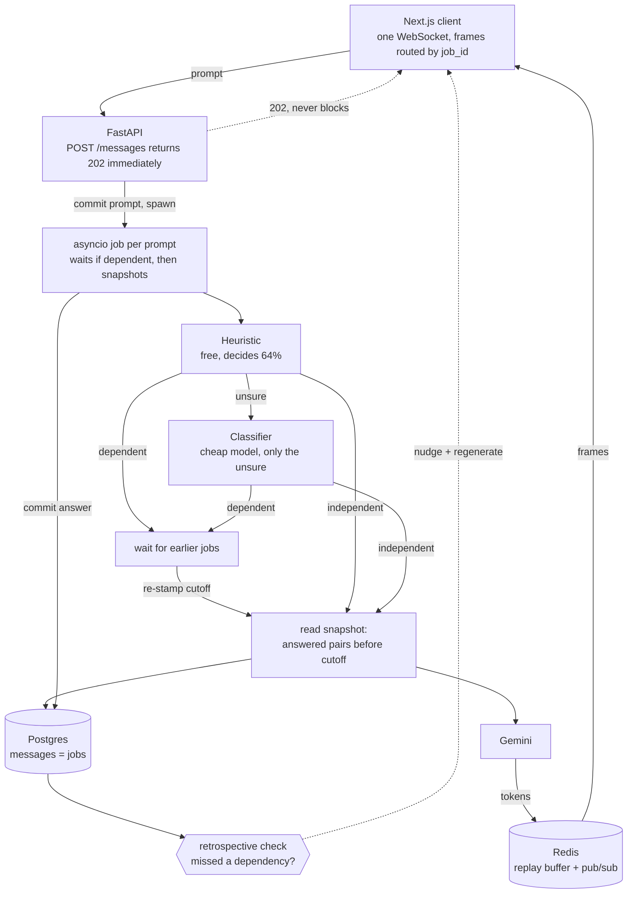

# InFlight

**A chat where the input box is never locked.** Fire a follow-up while a previous
answer is still generating; both run concurrently against one shared, evolving
history, and each is reconciled back into it using a snapshot-based (MVCC-like)
concurrency model rather than a hard queue.

The name is the state the interface is built around: at any moment several
answers are *in flight*, and the design's whole job is making that legible
instead of hiding it behind a spinner.

This is a systems/concurrency project wearing an AI costume. The interesting part
is not the model call — it is deciding what "the conversation so far" means when
two answers are in flight at once.

**Complete — all 12 stages.** Several prompts generate at once against one shared
history, each reading its own snapshot. Prompts that need an earlier answer are
detected and made to wait — **47/47** on 50 labelled cases, **0 missed
dependencies, 0 needless waits** — and anything that slips through gets a
retrospective nudge with a one-click re-run. Submitting stays flat at 30–50 ms
with 24 answers already streaming.

See [Results](#results) for the measurements and
[Known limitations](#known-limitations-stated-up-front-not-buried) for where it
can still be wrong.

---

## The idea in one column

Concurrency control lives in the `messages` table, which stores *jobs*, not just
chat bubbles. Three timestamps do the work:

| Column | Meaning |
| --- | --- |
| `submitted_at` | When the user hit send. Controls **display** order — the conversation reads top-to-bottom the way the user experienced it. |
| `completed_at` | When generation finished. Controls **commit** order — a row only becomes visible as context once it has committed. |
| `context_cutoff` | The read snapshot stamped on the job when it started. It may only read messages that committed strictly before this instant. |

With one prompt in flight these three collapse into the same ordering, which is
why ordinary chat apps never need to distinguish them. With two in flight they
come apart, and that gap is the entire problem this project is about.

`GET /conversations/{id}/context` makes the read side inspectable: it returns
exactly what a job stamped at a given instant would be allowed to see. A prompt
submitted earlier but still streaming is correctly absent from it.

### Why this is the interesting part

The moment two answers are in flight, "the conversation so far" stops being a
single well-defined thing. Prompt B, submitted while A is still generating, has
to be answered against *some* version of history — and the version that exists
when B is submitted is not the version that exists when B finishes. That is not
a rendering problem, it is a read-isolation problem, and databases have a
50-year-old answer to it.

So this borrows the answer wholesale. A job's `context_cutoff` is a **read
snapshot**; dependency detection is **conflict prediction**; the regenerate nudge
is **abort and retry**. What is unusual is not the mechanism but where it is
applied: MVCC is normally protecting rows from concurrent writers, not protecting
a chat transcript from being read halfway through being written.

The async plumbing is ordinary. The hard part is deciding what a prompt is
allowed to see, and being able to defend the answer.

### Architecture



The load-bearing detail is the dotted line: `202` returns before any of the rest
happens. Everything expensive — classification, waiting, generation — lives in
the job, never in the request.

---

## Results

Two claims, two harnesses. Reproduce with:

```bash
docker compose exec backend python -m scripts.eval_pipeline
docker compose exec backend python -m scripts.load_test --jobs 24
```

### Does it know when a prompt must wait?

50 hand-labelled prompts in [eval/dependency_cases.json](eval/dependency_cases.json),
balanced 25/25, run through the real path — heuristic first, classifier only for
what it defers.

| | decided | accuracy |
| --- | --- | --- |
| Heuristic alone | 32/50 (64%) | **32/32 (100%)** |
| **+ classifier** | 47/47 (100%) | **47/47 (100%)** |

**Missed dependencies: 0. Needless waits: 0.** That asymmetry is the number that
matters — a missed dependency ships a wrong answer, a needless wait costs only
latency — and a single accuracy figure hides which one you are making.

The heuristic is free and never wrong on what it decides; the classifier costs
one cheap call and closes the remaining 36%. Per-category output shows where each
earns its keep: the heuristic settles all `continuation`, `self-contained` and
`operates-on-output` cases, and defers every `ellipsis`, `local-pronoun` and
`bare-demonstrative` one.

**Read this number with two caveats.** Three cases could not be scored — the
free-tier quota returned errors, and an outage is not a judgement, so they are
excluded rather than counted. And 50 self-authored cases is a small set written
by the same person who wrote the detector: it is enough to catch regressions and
to show the shape of the failures, not enough to claim a true error rate. The
honest reading is "no *known* failure mode is unhandled", not "this does not
fail".

Each case is scored against the predecessor it would realistically follow,
stored per case. An earlier version posed every prompt against one fixed
unrelated turn, which made *"Refactor this function to be tail recursive"* look
like a classifier error — it is not, since that prompt genuinely does not depend
on an explainer about virtual memory. That was the harness measuring itself.

### Does concurrency actually work under load?

N prompts at randomised intervals against the local generator — a real provider
would measure its own queueing and rate limits, not this system's scheduling.

| prompts | peak concurrent | submit median | TTFT median | TTFT p95 | wall |
| --- | --- | --- | --- | --- | --- |
| 4 | **4** | 34 ms | 59 ms | 88 ms | 4.1 s |
| 8 | **8** | 52 ms | 97 ms | 204 ms | 4.3 s |
| 16 | **16** | 30 ms | 53 ms | 79 ms | 4.9 s |
| 24 | **24** | 38 ms | 70 ms | 171 ms | 6.4 s |

Peak concurrency equals the number submitted at every level: nothing is being
quietly serialised. Submit latency stays flat at 30–50 ms whether 4 or 24 answers
are already streaming — which is the non-blocking claim, stated as a measurement
rather than an assertion. Twenty-four concurrent answers finish in 6.4 s of wall
clock.

Run at the default cap of 8, the same test reports `accepted 8, rejected(429) 4`
— the guardrail from Stage 10, doing its job.

---

## Known limitations (stated up front, not buried)

**Dependency detection will be wrong sometimes.** It is keyword matching plus a
cheap classifier, not understanding. 100% on 50 self-authored cases means no
*known* failure mode is unhandled — not that it does not fail. The set was
written by the same person who wrote the detector, which is a real bias no amount
of care removes.

That is why the design does not rely on being right. Two layers exist precisely
for when it is not: the **chain override** (correct by construction, no
prediction involved) and the **retrospective nudge** (catches the miss after the
fact and offers a re-run). Defence in depth is the response to a component that
is known to be fallible, not an apology for it.

**The heuristic is English-only and shallow.** No parser, no POS tagging, no
coreference resolution. It knows that quoted text is being mentioned rather than
used, and that a relative-clause "that" is not a pointer, because those cases
were hit and fixed — not because it models grammar.

**The retrospective check is cruder still.** Two shared topic words. It is tuned
to over-offer, because a false positive costs a dismissible suggestion and a false
negative costs a silently wrong answer.

**Waiting is bounded, and the bound is a guess.** Past `MAX_DEPENDENCY_WAIT_SECONDS`
a job proceeds with a stale snapshot rather than hanging. That is the right
trade, but it is a trade.

**Single-process.** Jobs live in one FastAPI worker's event loop. Redis pub/sub
means the streaming layer would survive horizontal scaling, but cancellation and
the in-memory task registry would not — a second worker could not cancel the
first's jobs.

**Not novel research.** MVCC is decades-old database theory and concurrent async
requests are routine. What appears to be unbuilt is the specific combination — N
generations in flight against one shared linear history, resolved by snapshot
isolation rather than by queuing or branching. That is a defensible "nobody ships
this", not an invention.

---

## Stack

- **Frontend** — Next.js 14 (App Router), Tailwind, Framer Motion
- **Backend** — FastAPI + `asyncio`
- **Realtime** — one WebSocket per client, multiplexed by `job_id`
- **State / pub-sub** — Redis (job status + streaming chunk fan-out)
- **Persistence** — Prisma + Postgres
- **Models** — Gemini: `gemini-3.6-flash` for generation, `gemini-3.5-flash-lite`
  for the Stage 7 dependency classifier

No GPU, no self-hosted inference, no training. Every "smart" feature later in the
plan is a heuristic, a cheap classifier call, or a UI affordance.

### Who owns the schema

`prisma/schema.prisma` is the single source of truth for the database, and Prisma
owns migrations. The Python backend reads and writes those same tables through
SQLAlchemy rather than a generated Prisma client, so `backend/app/models.py` is a
hand-maintained mirror. That duplication is only safe if something checks it:

```bash
docker compose exec backend python -m scripts.check_schema
```

Run it after every migration. It compares the mapped tables and columns against
the live database and exits non-zero on drift.

All `DateTime` columns are `timestamptz(6)`. In a system whose correctness rests
on comparing instants written by different concurrent tasks, a timestamp without
a zone is a latent bug — and so is one without enough precision. The columns
started at `timestamptz(3)`, which silently rounded away the one-microsecond
offset that makes a job's cutoff admit its own prompt, colliding the two
instants. Precision here is load-bearing, not cosmetic.

---

## Running it

Requirements: Docker, and Node 18+ on the host if you want to run migrations
without the containerized runner.

```bash
cp .env.example .env          # defaults work as-is for local development
docker compose up -d --build  # postgres, redis, backend, frontend
npm install                   # Prisma CLI (host-side)
npx prisma migrate dev        # create/apply migrations
```

| Service | URL |
| --- | --- |
| Frontend | http://localhost:3000 |
| Backend | http://localhost:8000 |
| API docs | http://localhost:8000/docs |
| Health | http://localhost:8000/health |

If you would rather not install Node locally, run migrations through the
one-shot container instead:

```bash
docker compose --profile tools run --rm migrate
```

It runs on Debian rather than Alpine — Prisma's schema engine is a native binary
that needs glibc and OpenSSL, and fails to start on musl. The first run installs
OpenSSL and downloads the Prisma CLI, so give it a few minutes; the host-side
`npx prisma migrate dev` is much faster for day-to-day work.

Set `GEMINI_API_KEY` in `.env` before Stage 2's chat will generate anything — get
one from [AI Studio](https://aistudio.google.com/apikey). Without it the app
still runs, and prompts fail with a visible `GEMINI_API_KEY is not set` on the
bubble rather than silently hanging.

### Ports already in use

`POSTGRES_PORT`, `REDIS_PORT`, `BACKEND_PORT`, and `FRONTEND_PORT` in `.env`
remap the published ports. Note that `DATABASE_URL` in `.env` is the *host-side*
URL used by the Prisma CLI; the backend container gets its own URL pointing at
the `postgres` service name, set in `docker-compose.yml`.

---

## The interface

Warm paper surface, serif greeting, a card composer, and a left rail of recents —
familiar on purpose, so the one genuinely unusual thing stands out rather than
competing with novel chrome.

That one thing is the **status strip along the bottom of the composer**. Where
other assistants put a plan or a usage meter, InFlight puts what is happening
right now: how many answers are in flight, how many have landed, tokens, and
estimated cost — all updating live off the same frames that fill the bubbles.

The rest follows from the same idea. Each answer carries its own state chip, so
three streaming at once are legible at a glance. A held prompt says *waiting for
the previous answer* rather than stalling silently. `↩ chain` and `stop` appear on
hover over any bubble, including one still streaming. Blue means exactly one
thing throughout — in flight — and is used nowhere else.

## Demo

Three things worth showing, in order. Run with `USE_FAKE_LLM=true` for
predictable timing, or a real key for genuine answers.

**1. Concurrency — the core claim.** Send "Explain quantum computing in detail",
then immediately "What is the capital of Japan?". Both bubbles stream at once;
the short one finishes first without moving the long one. The input never locks.

**2. A dependency correctly waiting.** Send "List three sorting algorithms", then
immediately "Now do the same for search algorithms". The second bubble shows
*waiting for the previous answer…*, then answers about search — proving it read
what it waited for. Contrast with `↩ chain` on a still-streaming bubble, which
forces the same wait with no prediction involved.

**3. The safety net.** Send two overlapping prompts on one topic where the second
refers back ("...and why its lookups are fast"). When both land, the second
carries *"This answer may not have had your earlier prompt's context"* and a
**regenerate** button that re-runs it with the fuller snapshot.

## Roadmap

| Stage | What it adds |
| --- | --- |
| 1 ✅ | Foundations and data model |
| 2 ✅ | Baseline single-threaded chat (the control group) |
| 3 ✅ | Concurrency plumbing — remove the input lock |
| 4 ✅ | History reconciliation UI |
| 5 ✅ | Token/cost dashboard |
| 6 ✅ | Dependency heuristic |
| 7 ✅ | Dependency classifier (cheap model call, ambiguous cases only) |
| 8 ✅ | Manual "chain" override |
| 9 ✅ | Optimistic fallback + regenerate nudge |
| 10 ✅ | Resilience: cancel, reconnect, per-job failure isolation |
| 11 ✅ | Evaluation harness |
| 12 ✅ | Documentation, demo, writeup |

---

See [docs/build-log.md](docs/build-log.md) for what each stage added, the bugs
testing found, and why each design decision went the way it did.
